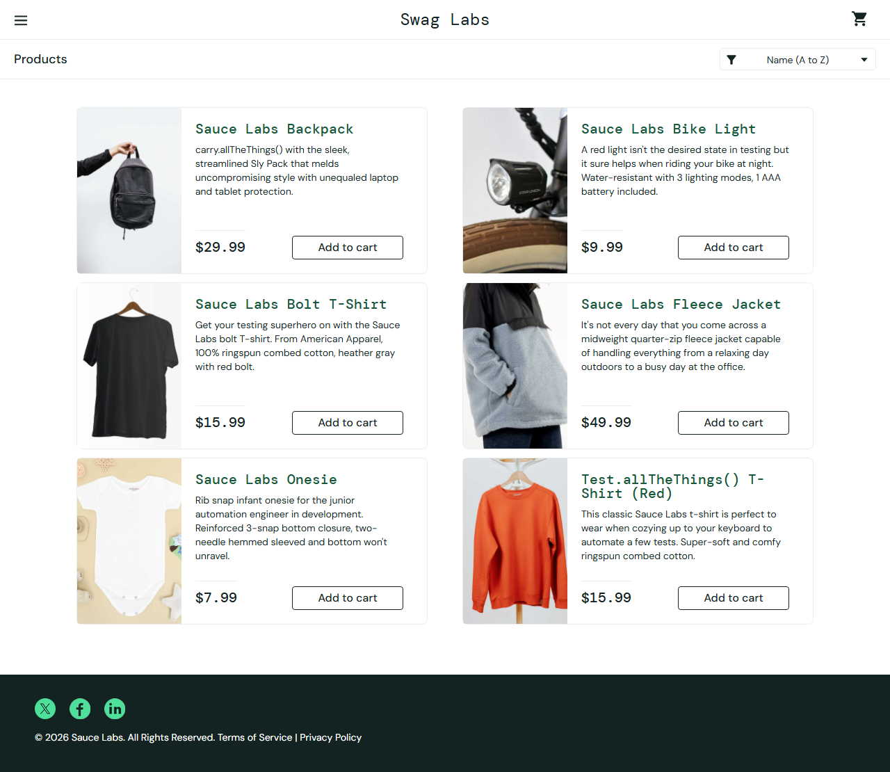
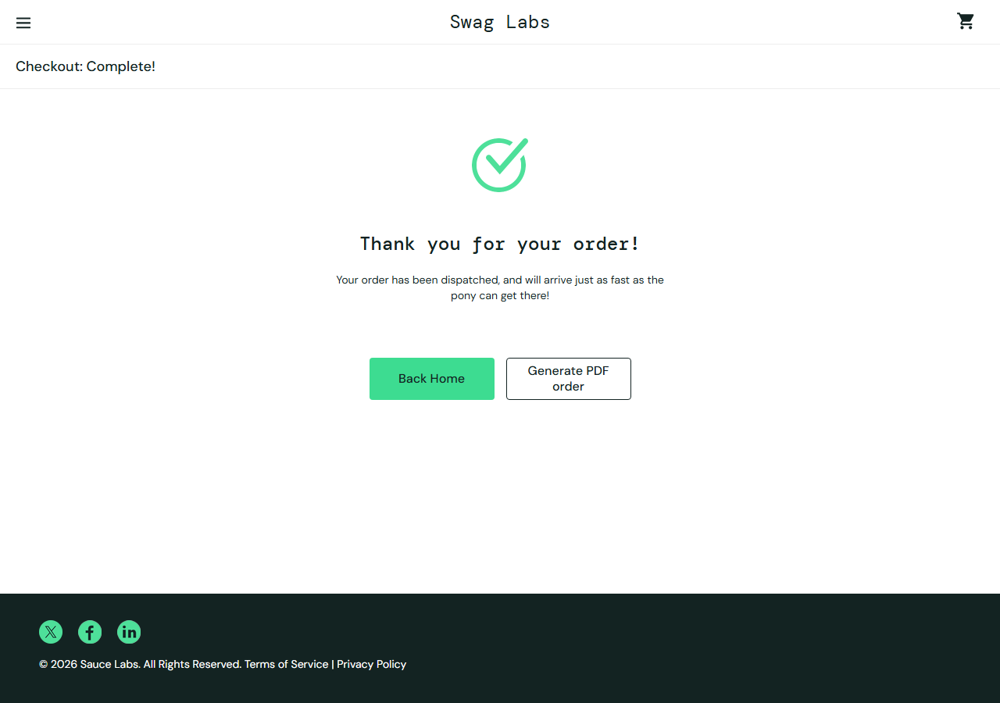

# QA Automation Portfolio — Playwright + TypeScript

A practical automation project by **Rashed Ahmed**, covering an e-commerce customer journey from login to order confirmation. Tests use Playwright, TypeScript, Page Object Model, browser isolation, and GitHub Actions.

**UI application:** [SauceDemo](https://www.saucedemo.com/) · **API practice service:** [Automation Exercise](https://automationexercise.com/api_list)



## Quick start

Install Node.js 24 LTS and Git. From the repository directory:

```sh
npm ci
npx playwright install chromium firefox
npm run typecheck
npm test
npm run report
```

On Linux, use `npx playwright install --with-deps chromium firefox` to install browser system dependencies too. Both external demo sites must be reachable. No application server, paid service, or private credentials are needed. SauceDemo publishes `standard_user` / `secret_sauce` and `locked_out_user` for practice.

## Commands

| Command | Purpose |
| --- | --- |
| `npm test` | Full Chromium, Firefox, and API suite |
| `npm run test:ui` | Browser tests in Chromium |
| `npm run test:api` | API tests only, no browser required |
| `npm run test:smoke` | Critical login, cart, checkout, and catalog API tests |
| `npm run test:headed` | Watch browser tests |
| `npm run test:debug` | Step through tests using Playwright Inspector |
| `npm run typecheck` | Validate TypeScript |
| `npm run screenshots` | Refresh the two README demo screenshots |
| `npm run report` | Open the latest HTML report |
| `npx playwright test --project=firefox` | Firefox browser suite |

To run one test file: `npx playwright test tests/ui/cart.spec.ts --project=chromium`.

## Coverage

| Area | Automated checks | Scenarios |
| --- | --- | ---: |
| Login | Successful login, invalid password, locked user, missing username/password | 5 |
| Products | Product details and add action; name A–Z/Z–A and price ascending/descending | 5 |
| Cart | Add two products, remove one, price/badge checks, reload persistence; remove final item, return to shopping | 2 |
| Checkout | Items, subtotal, tax, grand total, confirmation; each required field; cancel preserves cart | 5 |
| API | Product catalog structure, product search, missing search parameter | 3 |

There are **20 distinct scenarios**: 17 browser scenarios run in each of two browsers, plus 3 API tests (**37 total executions**). `@smoke` marks the most critical paths.

SauceDemo provides sorting rather than text search or category filtering. The UI suite tests every available sort option; the supplemental API suite covers text search. The API tests use a separate demo service and do not validate SauceDemo's backend or data consistency with its UI. Automation Exercise returns application error codes in its JSON body; tests distinguish those from HTTP status codes.

## Architecture

```text
.github/workflows/playwright.yml   CI execution and evidence upload
pages/
  login.page.ts                   Login actions and error locator
  inventory.page.ts               Catalog actions and sort controls
  cart.page.ts                    Cart actions
  checkout.page.ts                Customer details and order completion
tests/
  fixtures.ts                     Typed page object fixtures
  ui/                             Login, product, cart, checkout specs
  api/products.spec.ts            Request-based API tests
playwright.config.ts              Projects, timeouts, reporters, evidence
tsconfig.json                     Strict TypeScript checking
package-lock.json                 Reproducible dependencies for npm ci
```

Page objects contain reusable actions and locators. Specs contain the assertions that describe expected business behavior. Fixtures create page objects for each test. Each browser test gets a new browser context and logs in independently, avoiding shared cart state and order dependencies. API tests use Playwright's request fixture.

Locators prefer the site's `data-test` attributes and accessible button roles. Playwright's automatic waiting and retrying assertions replace fixed sleeps. Parameterized cases keep field-validation and sorting tests short while reporting each scenario separately. Two workers limit load on public demo services.

To add coverage, add an action to the relevant page object if needed, then add a focused spec with observable assertions. Keep test data synthetic. Do not hide failures behind arbitrary waits or unconditional retries.

## Reports, screenshots, and debugging

After a run, `npm run report` opens `playwright-report/index.html`. Expand a failed test to see its error, screenshot, video, and trace. Generated reports and evidence are ignored by Git.

- Screenshots: captured on failure.
- Videos and traces: recorded during tests, retained only on failure.
- Raw attachments: under `test-results/`.
- Trace inspection: `npx playwright show-trace path/to/trace.zip`.

The included catalog and confirmation images were captured on October 4, 2026. Refresh them with `npm run screenshots`. This optional script demonstrates the UI; the assertions in the test suite provide verification. A screenshot of the HTML report provides run evidence; include its date and browser versions rather than claiming a permanent pass rate. See `docs/VALIDATION.md` for the initial verification.



## CI

GitHub Actions runs on pushes and pull requests to `main`, plus manual dispatch. It installs locked dependencies, checks types, installs Chromium/Firefox, and runs all tests. It uploads `playwright-report/` and `test-results/` as the `playwright-evidence` artifact even after failure, retained for 14 days. Download and unzip the artifact, then run `npx playwright show-report path/to/playwright-report` to view it.

CI allows one retry for transient public-site failures; local runs have no retries. A retry that passes is reported as flaky and should be investigated. The workflow has been prepared locally; its first hosted run occurs after publishing.

## Configuration and scope

Optional environment variables: `BASE_URL` and `API_BASE_URL`. `.env.example` documents defaults; it is not loaded automatically. PowerShell example:

```powershell
$env:BASE_URL = 'https://www.saucedemo.com'
npm run test:ui
```

Only override these to a compatible test environment. This suite targets public practice applications. Checkout creates a simulated order, not a real purchase. Coverage does not include real payments, accessibility audits, performance, mobile devices, postal-code format rules, or production security. Site outages and UI changes can cause failures; inspect evidence before deciding whether a defect belongs to the application or the test.

## Publish to GitHub

The local Git repository is initialized on `main`. Create an **empty** GitHub repository named `qa-automation-portfolio` under your account; do not add a README, license, or gitignore on GitHub. Then:

```sh
git remote add origin https://github.com/af58169-cloud/qa-automation-portfolio.git
git push -u origin main
```

Authenticate through Git Credential Manager when prompted. Open the repository's **Actions** tab and inspect the first run. Add a description such as “Playwright + TypeScript e-commerce automation with Page Object Model, UI/API tests, and GitHub Actions.” Suggested topics: `playwright`, `typescript`, `test-automation`, `qa`, `page-object-model`.

After CI passes, pin the repository to your profile and add its URL to your resume. Suggested project bullet: “Built a Playwright and TypeScript automation framework with Page Object Model, 20 UI/API scenarios, Chromium and Firefox coverage, failure diagnostics, and GitHub Actions CI.” Use this as portfolio experience, not as a claim of employer experience.

## References

- [Playwright configuration](https://playwright.dev/docs/test-configuration)
- [Page Object Model](https://playwright.dev/docs/pom)
- [Failure recording options](https://playwright.dev/docs/test-use-options#recording-options)
- [Playwright CI guide](https://playwright.dev/docs/ci)
- [Automation Exercise API contracts](https://automationexercise.com/api_list)
